<h1 align="center">
  Olá 👋, eu sou Jailson França
</h1>

<h3 align="center">
  Full Stack Developer | Java | Spring Boot | React
</h3>

━━━━━━━━━━━━━━━━━━━━━━━━━━━━━━━━━━━━━━━━━━━━━━━━━━━━━━━━━━━━━━━

## 👨‍💻 Sobre mim

Sou Desenvolvedor Full Stack com experiência no desenvolvimento de aplicações
web e APIs RESTful, atuando principalmente com **Java + Spring Boot** no
backend e **React + TypeScript** no frontend.

Tenho experiência com:

- ☕ Desenvolvimento de APIs REST com Java e Spring Boot
- 🔐 Autenticação e autorização com Spring Security / JWT
- 🗄️ PostgreSQL e MySQL
- ⚛️ React e TypeScript
- 🐳 Docker e ambientes containerizados
- 🧪 Testes automatizados
- 🔄 Git, GitHub e integração contínua

🎯 Atualmente, meu foco está em evoluir minhas habilidades em **Backend Java,
arquitetura de APIs e desenvolvimento de aplicações escaláveis**.

## 📚 Atualmente estudando

- ☕ Java & Spring Boot
- 🏗️ Arquitetura de Software
- 🔐 Spring Security & JWT
- 🧩 Microsserviços
- 🐳 Docker & Kubernetes
- ☁️ AWS
- 🔄 CI/CD
- 🧪 Testes automatizados

━━━━━━━━━━━━━━━━━━━━━━━━━━━━━━━━━━━━━━━━━━━━━━━━━━━━

🚀 TECNOLOGIAS

## ☕ Backend

   

## ⚛️ Frontend

    

## 🗄️ Banco de Dados

## 🐳 DevOps / Cloud

━━━━━━━━━━━━━━━━━━━━━━━━━━━━━━━━━━━━━━━━━━━━━━━━━━━━
<h2 align="center">📊 GitHub Analytics</h2>

━━━━━━━━━━━━━━━━━━━━━━━━━━━━━━━━━━━━━━━━━━━━━━━━━━━━

## 🐍 Contribution Snake

## 📫 Contato

